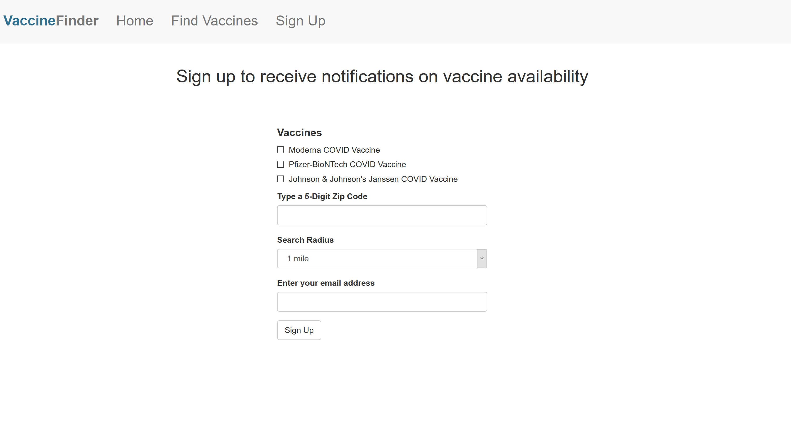
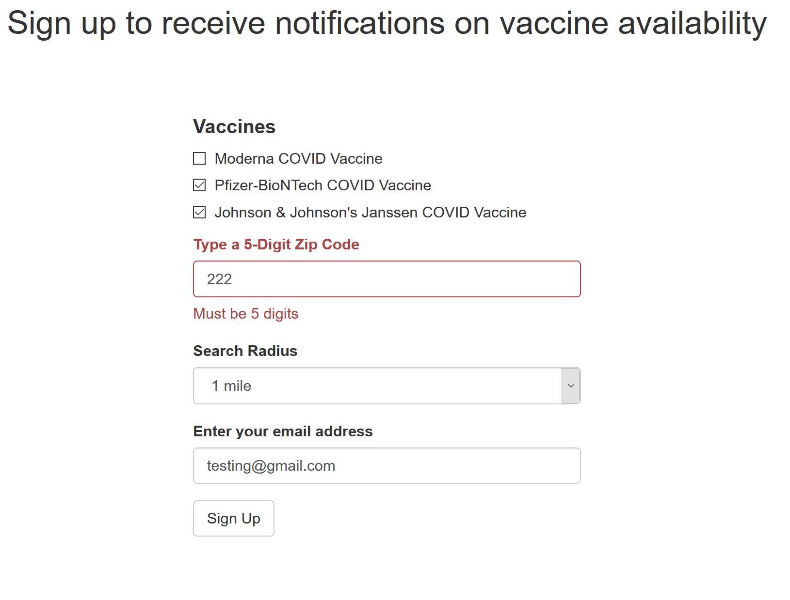

# COVID-19-Vaccine-Availability-Notifier
Uses [VaccineFinder.org](https://vaccinefinder.org/) to notfiy users of available COVID-19 Vaccines based on their preferences.

If you're interested in hosting this code, or using any parts of it please first reach out to the team at VaccinesFinder. 
The contact form is [here](https://docs.google.com/forms/d/e/1FAIpQLSf00jHygTZv49JrhJvUvkPJb-saifBKQIcofEJBEZ7bSIzVRQ/viewform).

# How it Works
The sign up form records a users infromation and preferences on the following:
- Which vaccines they're intersted in (Pfizer, Moderna, J&J)
- What location they're searching in (Zip Code)
- How far they're willing to travel (Radius)

These preferences are then uploaded to a SQL database along with the users email.
The database will then be queried and a link with a users preferences will be constructed. 
Selenium will use the constructed link to scrape VaccineFinder and check to see if there are vaccines available based on a users preferences. 
If there are vaccines available, an email will be sent to the user with the constructed link letting them know they can access the link and find out more informaiton. 
If there are no vaccines available, an email will not be sent. 

# Scaling and Other Considerations
- Currently a SQLite databse is being used for testing purposes and development. Before hosting/moving to production, a PostgreSQL database should be connected.
- Some URLs in the flask template need to be updated depending on the pathing of the hosted webpage.
- If the database grows too large, users who registered later may recieve their notifications too late because the notification system is set to go row by row of the database.
- The database table can be split into states using zip code ranges (e.g. 10XXX - 11XXX for NYC) and separate scripts can be run to speed up the notification process.
- Vaccine availability is updated around approximately ~6 am EST / 3 am PST, the notification system should be set to run somewhere around this time

# Requirements
- flask
- flask_bootstrap
- flask_sqlalchemy
- wtforms
- sqlite3
- selenium
- smtplib

# Screenshots

There is also basic validation included with the sign up form

